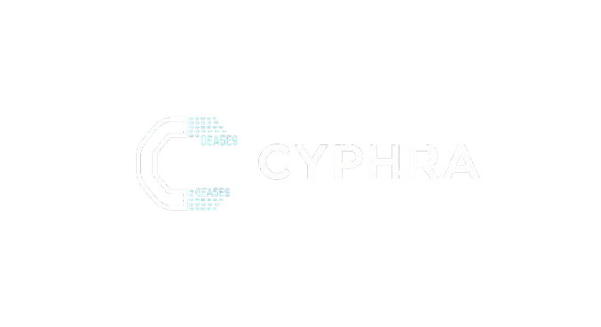

<p align="center">
  
</p>

<h1 align="center">C Y P H R A</h1>

<p align="center">
  <strong>Real-Time AI-Powered Threat Detection · Autonomous Response · Military-Grade Secure Communications</strong>
</p>

<p align="center">
  <em>"The platform that doesn't just detect threats — it fights back."</em>
</p>

<p align="center">
  
  
  
  
  
</p>

---

## 🔍 What is CYPHRA?

CYPHRA is a production-grade cybersecurity platform combining **three operational centers** into a unified system designed for defence-grade secure communications and real-time threat intelligence.

<table>
<tr>
<td width="33%" align="center">

### 🛡️ SOC
**Security Operations Center**

Live packet capture → 6-model ML ensemble → autonomous firewall response

*98.85% accuracy, 5ms inference*

</td>
<td width="33%" align="center">

### 📡 DOC
**Defence Operations Center**

Signal health monitoring, EW threat detection, tamper-evident audit logging

*8 attack signatures, SHA-256 chain*

</td>
<td width="33%" align="center">

### 💬 Ghost Messenger
**Encrypted Communications**

E2E encrypted chat with self-destructing messages + keystroke biometrics

*AES-256-GCM + Kyber-1024 PQC*

</td>
</tr>
</table>

---

## 🏗️ System Architecture

```
╔══════════════════════════════════════════════════════════════════════════════╗
║                              CLIENT PLATFORMS                                ║
║                                                                              ║
║   ┌────────────┐       ┌────────────────┐       ┌─────────────┐            ║
║   │   React    │       │    Android     │       │   iOS PWA   │            ║
║   │  Web App   │       │  Native App   │       │  (Safari)   │            ║
║   │   :5173    │       │ Kotlin/Compose │       │    :3002    │            ║
║   └─────┬──────┘       └───────┬────────┘       └──────┬──────┘            ║
╚═════════╪═══════════════════════╪════════════════════════╪══════════════════╝
          │                       │                        │
          ▼                       ▼                        ▼
╔══════════════════════════════════════════════════════════════════════════════╗
║                         NODE.JS BACKEND (:3001)                              ║
║                                                                              ║
║   Express REST API · WebSocket Relay · Signal Stats Engine                   ║
║   ML Proxy (:5002) · Crypto Proxy (:5050) · DB Proxy (VedDB)               ║
╚════════════╤═══════════════════════╤═══════════════════════╤════════════════╝
             │                       │                       │
             ▼                       ▼                       ▼
  ╔══════════════════╗   ╔══════════════════════╗   ╔════════════════════╗
  ║   VedDB Server   ║   ║   ML FastAPI (:5002) ║   ║ Rust Crypto API    ║
  ║    (:50051)      ║   ║                      ║   ║    (:5050)         ║
  ║                  ║   ║  6-Model Ensemble    ║   ║                    ║
  ║  Custom Rust     ║   ║  + Live Npcap        ║   ║  Kyber-1024        ║
  ║  Encrypted DB    ║   ║  + Auto-Response     ║   ║  PQC-Hybrid X3DH   ║
  ║  TLS 1.3         ║   ║  + Demo Attacks      ║   ║  BLAKE3 + AI       ║
  ╚══════════════════╝   ╚══════════════════════╝   ╚════════════════════╝
```

---

## ⚡ Threat Detection Pipeline

```
 [Network Interface Card]
        │  Npcap kernel driver
        ▼
 [Scapy Packet Sniffer] ─→ [FlowEngine: bidirectional 5-tuple aggregation]
                                    │
                                    ▼
                       [100 CICFlowMeter Features]
                       (packet lengths, IAT, flags, ratios, logs)
                                    │
                                    ▼
                       [StandardScaler: clip((x-μ)/σ, -10, +10)]
                                    │
                                    ▼
        ┌───────────────────────────────────────────────────┐
        │            6-MODEL SOFT-VOTING ENSEMBLE            │
        │                                                    │
        │   LGBM_Deep ──┐                                   │
        │   LGBM_Wide ──┤                                   │
        │   LGBM_Fast ──┤── mean(p₁...p₆) ──→ Score [0,1]  │
        │   XGB_Deep  ──┤                                   │
        │   XGB_Balanced┤                                   │
        │   CatBoost  ──┘                                   │
        │                                                    │
        │   Accuracy: 98.852%  │  F1: 96.990%               │
        │   Precision: 97.105% │  Recall: 96.875%           │
        └───────────────────────────────────────────────────┘
                                    │
                                    ▼
        ┌───────────────────────────────────────────────────┐
        │          AUTONOMOUS RESPONSE ENGINE                │
        │                                                    │
        │   ≥ 0.92 → T1: Windows Firewall IP block          │
        │   ≥ 0.80 → T2: TCP RST injection (Scapy)         │
        │   ≥ 0.65 → T3: Rate tracking → auto-escalate     │
        │                                                    │
        │   Auto-unblock: 300s │ Whitelist: localhost        │
        └───────────────────────────────────────────────────┘
```

---

## 🔐 Cryptographic Architecture

```
╔══════════════════════════════════════════════════════════════════════╗
║                      DUAL CRYPTO STACK                               ║
╠══════════════════════════════════════════════════════════════════════╣
║                                                                      ║
║  ┌─── Browser (Rust → WebAssembly, 153KB) ───────────────────────┐ ║
║  │  AES-256-GCM │ X25519 ECDH  │ Ed25519 Signatures             │ ║
║  │  HKDF-SHA256 │ Double Ratchet│ SHA-256 Hashing                │ ║
║  │  Web Crypto API fallback if WASM unavailable                   │ ║
║  └────────────────────────────────────────────────────────────────┘ ║
║                                                                      ║
║  ┌─── Server (Native Rust + libsodium + pqc_kyber) ──────────────┐ ║
║  │  Kyber-1024 (PQC) │ XChaCha20-Poly1305 │ BLAKE3 Hashing      │ ║
║  │  PQC-Hybrid X3DH  │ Double Ratchet     │ HKDF-BLAKE3         │ ║
║  │  Post-quantum resistant key exchange                           │ ║
║  └────────────────────────────────────────────────────────────────┘ ║
║                                                                      ║
║  ┌─── Android (Hardware-Backed) ──────────────────────────────────┐ ║
║  │  AES-256-GCM via Android Keystore (TEE/StrongBox)             │ ║
║  │  Keys NEVER leave hardware │ Biometric-gated access           │ ║
║  └────────────────────────────────────────────────────────────────┘ ║
║                                                                      ║
╠══════════════════════════════════════════════════════════════════════╣
║  SESSION: PQC-Hybrid X3DH (Kyber-1024 + X25519 + BLAKE3)         ║
║  FORWARD SECRECY: Double Ratchet (unique key per message)          ║
║  CONTEXT STRINGS: "CYPHRA-MSG-KEY" │ "CYPHRA-CHAIN-KEY"           ║
╚══════════════════════════════════════════════════════════════════════╝
```

---

## 🎖️ Mission Presets — Adaptive Security

| Preset | Ratchet Cadence | Traffic Padding | Mix Hops | Use Case |
|--------|:---:|:---:|:---:|----------|
| 🔇 **Silent Patrol** | 60s | 80% | 4 relays | Covert ops — hide all communication patterns |
| ⚖️ **Balanced** | 5 min | 30% | 2 relays | Normal operations — security + usability |
| 🏠 **Secure Base** | 1 hour | 10% | Direct | Trusted facility — maximum speed |
| 🚨 **Compromised** | 30s | 95% | 5 relays | Emergency — assume total surveillance |

**All presets trigger REAL mechanisms:**
- ⏱️ Auto-Ratchet: Timer advances chain key (forward secrecy for idle sessions)
- 📡 Traffic Padding: Encrypted dummy frames via WebSocket (indistinguishable from real)
- 🧅 Mixnet Routing: Messages pass through N independent relay nodes (onion encryption)

---

## 🧠 Machine Learning

### Training Data — 19.5 Million Labeled Network Flows

| Dataset | Year | Flows | Attack Types |
|:--------|:----:|------:|:-------------|
| CICIDS2017 | 2017 | 2,830,743 | DoS, DDoS, PortScan, Brute Force, Botnet |
| UNSW-NB15 | 2015 | 257,673 | Fuzzers, Backdoors, Exploits, Recon |
| ISCXVPN2016 | 2016 | 271,028 | VPN-encapsulated traffic (7 categories) |
| CSE-CICIDS2018 | 2018 | 16,233,002 | Botnet, Infiltration, Web Attacks, DDoS |
| **Total** | | **19,592,446** | **25+ attack categories** |

### Model Performance

| Model | Framework | Accuracy | F1-Score | GPU |
|:------|:----------|:--------:|:--------:|:---:|
| LGBM_Deep | LightGBM | 98.827% | 96.928% | CPU (32T) |
| LGBM_Wide | LightGBM | 98.822% | 96.916% | CPU (32T) |
| LGBM_Fast | LightGBM | 98.817% | 96.901% | CPU (32T) |
| XGB_Deep | XGBoost | 98.818% | 96.904% | CUDA |
| XGB_Balanced | XGBoost | 98.816% | 96.899% | CUDA |
| CatBoost_Deep | CatBoost | 98.841% | 96.962% | CUDA |
| **Ensemble (Soft Vote)** | **All 6** | **98.852%** | **96.990%** | — |

### 100 Features (CICFlowMeter-compatible)
Packet counts · Byte stats · Packet lengths (fwd/bwd) · Inter-arrival times · Flow rates · TCP flags (FIN/RST/PSH/ACK/URG) · Window sizes · Ratios · Engineered features · Log transforms · Dataset one-hot

---

## 💬 Ghost Messenger

```
┌──────────────────────────────────────────────────────────────────┐
│                      MESSAGE LIFECYCLE                             │
│                                                                    │
│  User types → AES-256-GCM Encrypt (Rust WASM)                    │
│            → ML Threat Scan (/analyze/message)                    │
│            → Store in VedDB (encrypted)                           │
│            → WebSocket broadcast to recipient                     │
│                                                                    │
│  SELF-DESTRUCT:                                                    │
│  Sender sends    → destructAt: null (no countdown)               │
│  Message arrives → destructAt: null (no countdown)               │
│  Recipient OPENS CHAT → destructAt = now + 10s (countdown!)     │
│  Timer hits 0    → DELETE from all stores + broadcast delete     │
│                                                                    │
│  GHOST CODES: GHOST-{first4}-{last4} of SHA-256(email)          │
│  READ RECEIPTS: ✓ sent → ✓✓ delivered → ✓✓ read (blue)         │
│  CROSS-PLATFORM: Web ↔ Android ↔ iOS (same WebSocket backend)  │
└──────────────────────────────────────────────────────────────────┘
```

---

## 📁 Project Structure

```
cyphra/
├── web-app/                        ← React frontend + Node.js backend
│   ├── src/
│   │   ├── pages/                  6 pages: Landing, Auth, Dashboard, SOC, DOC, Messenger
│   │   ├── services/               9 services: crypto, auth, threat, defense, ml, veddb, 
│   │   │                           wasm-bridge, mixnet, padding
│   │   ├── components/             Layout, MLDashboard, Toast, WebGLBackground
│   │   ├── store/                  Zustand state management
│   │   └── lib/ghostencoder/       Custom JS neural network (keystroke biometrics)
│   ├── backend/
│   │   ├── server.js               Express + WebSocket + Signal Stats + ML/Crypto Proxy
│   │   └── services/               VedDB client integration
│   ├── mixnet/                     5 independent relay nodes (onion routing)
│   └── public/wasm/                Compiled Rust WASM crypto (153KB)
│
├── rust-libraries/                 ← 8 In-house Rust crates
│   ├── core/                       Types, errors, HKDF-BLAKE3, libsodium
│   ├── protocol/                   PQC-Hybrid X3DH + Double Ratchet
│   ├── ai/                         Threat scoring + anomaly detection
│   ├── network/                    Traffic shaping + timing obfuscation
│   ├── storage/                    Crypto-erase + encrypted SQLite
│   ├── backend/                    Mailbox + key distribution
│   ├── mixnet/                     Sphinx onion routing
│   └── server/                     REST API (Kyber-1024, X3DH, BLAKE3, AI, TLS VedDB)
│
├── cyphra-wasm/                    ← Pure-Rust WASM (AES-GCM, X25519, Ed25519, HKDF)
├── veddb-cyphra/                   ← VedDB client library (TLS 1.3, async, connection pool)
├── machine_learning/               ← Complete ML pipeline
│   ├── models/                     6 trained model files + scaler + metadata
│   ├── training_scripts/           8 pipeline scripts (combine→preprocess→train→ensemble)
│   ├── inference_service/          FastAPI + Scapy capture + auto-response + demo attacks
│   └── ghostml_library/            Custom Rust ML framework (8 crates)
│
├── cyphra-android/                 ← Native Android (Kotlin + Compose + Keystore)
├── cyphra-pwa/                     ← iOS Progressive Web App
├── cyphra-business/                ← Business plan website
├── documentation/                  ← Technical specs (100-page doc + tech stack reference)
└── scripts/                        ← Build, deploy, demo utilities
```

---

## 🚀 Quick Start

```bash
# 1. Database
veddb-server.exe

# 2. Rust Crypto API
cd rust-libraries/server && start.bat

# 3. ML Service (as Administrator — for Npcap access)
cd machine_learning/inference_service && python main.py

# 4. Backend
cd web-app/backend && node server.js

# 5. Frontend
cd web-app && npm install && npm run dev

# 6. Mixnet Relays (optional — for onion routing)
cd web-app/mixnet && start_mixnet.bat
```

**Open** → `http://localhost:5173` → Register → Chat → Monitor threats

---

## 🎯 Live Demo

```bash
# Inject 8 real attack types through the ML ensemble
cd scripts && python demo_soc_doc.py

# Or use the batch file
demo.bat
```

Watch the SOC dashboard fill with: DDoS → SSH Brute Force → Port Scan → Slowloris → SQL Injection → C2 Beacon → FTP Brute → Heartbleed — all with **real model scores**.

---

## 🔌 API Reference

<details>
<summary><b>ML Service (:5002) — 10 endpoints</b></summary>

| Method | Endpoint | Purpose |
|:------:|:---------|:--------|
| GET | `/health` | Service health + capture status |
| GET | `/model/info` | Accuracy, architecture, datasets |
| GET | `/realtime/feed` | Last 50 classified flows |
| GET | `/monitor/stats` | Live NIC packet counters |
| POST | `/analyze/flow` | Classify a flow vector |
| POST | `/analyze/message` | Threat scan on text content |
| POST | `/demo/inject` | Inject calibrated attack for demo |
| GET | `/response/status` | Blocked IPs + action log |
| POST | `/response/unblock` | Manual IP unblock |
| POST | `/response/toggle` | Enable/disable auto-response |

</details>

<details>
<summary><b>Rust Crypto Server (:5050) — 10 endpoints</b></summary>

| Method | Endpoint | Purpose |
|:------:|:---------|:--------|
| GET | `/api/v1/health` | Service health + loaded crates |
| POST | `/api/v1/crypto/keypair/identity` | Kyber-1024 + X25519 keypair |
| POST | `/api/v1/crypto/keypair/signed` | Ed25519 signed prekey |
| POST | `/api/v1/crypto/keypair/onetime` | Batch one-time prekeys |
| POST | `/api/v1/crypto/x3dh/initiate` | PQC-Hybrid X3DH session (sender) |
| POST | `/api/v1/crypto/x3dh/accept` | X3DH session acceptance (receiver) |
| POST | `/api/v1/crypto/hkdf` | HKDF-BLAKE3 key derivation |
| POST | `/api/v1/crypto/hash` | BLAKE3 hash |
| POST | `/api/v1/ai/threat-score` | Multi-signal threat scoring |
| POST | `/api/v1/ai/anomaly-detect` | Flow anomaly detection |

</details>

<details>
<summary><b>Node.js Backend (:3001) — 25+ endpoints</b></summary>

| Category | Endpoints |
|:---------|:----------|
| Storage | `POST /api/storage/set`, `GET /api/storage/get/:key`, `DELETE /api/storage/delete/:key` |
| Users | `POST /api/users`, `GET /api/users/:userId` |
| Messages | `POST /api/messages`, `GET /api/messages/chat/:chatId` |
| Contacts | `POST /api/contacts`, `GET /api/contacts/user/:userId` |
| ML Proxy | `GET/POST /api/ml/*` → forwards to :5002 |
| Crypto Proxy | `GET/POST /api/cyphra/*` → forwards to :5050 |
| VedDB (TLS) | `POST /api/db/set`, `GET /api/db/get/:key`, `DELETE /api/db/delete/:key` |
| Signal | `GET /api/signal/stats` (real hardware telemetry) |
| Mixnet | `POST /api/mix/deliver` (relay chain endpoint) |
| WebSocket | `ws://host:3001/ws` (subscribe, message, padding, ping) |

</details>

---

## 🛠️ Technology Stack

| Layer | Technologies |
|:------|:------------|
| **Frontend** | React 18 · Vite · TailwindCSS · Zustand · Three.js · Framer Motion · GSAP |
| **Backend** | Node.js · Express · WebSocket (ws) · FastAPI · Uvicorn |
| **ML** | GhostML (Rust) · LightGBM · XGBoost · CatBoost · Scapy · Npcap |
| **Crypto (WASM)** | Rust → WebAssembly · aes-gcm · x25519-dalek · ed25519-dalek · hkdf · sha2 |
| **Crypto (Native)** | Rust · libsodium · pqc_kyber · blake3 · XChaCha20-Poly1305 |
| **Server** | Axum · Tokio · Tower · tower-http |
| **Database** | VedDB (custom Rust · TLS 1.3 · async · connection pool · 62 opcodes) |
| **Mobile** | Kotlin · Jetpack Compose · Material3 · OkHttp · Android Keystore (TEE) |
| **Standards** | NIST FIPS 203 (Kyber) · RFC 7748 (X25519) · RFC 8032 (Ed25519) · RFC 5869 (HKDF) |

---

## 🏋️ Training Hardware

| Component | Specification |
|:----------|:-------------|
| CPU | AMD Ryzen 9 9955HX (16C/32T) |
| GPU | NVIDIA GeForce RTX 5070 Ti Laptop (12GB GDDR7) |
| RAM | 32GB DDR5 |
| CUDA | 13.0 |
| Total Training Time | 65 minutes (all 7 models) |

---

## 📚 Research References

1. Sharafaldin et al. — *CICIDS2017 Dataset* — ICISSP 2018
2. Moustafa & Slay — *UNSW-NB15 Dataset* — IEEE MilCIS 2015
3. Chen & Guestrin — *XGBoost* — KDD 2016
4. Ke et al. — *LightGBM* — NeurIPS 2017
5. Prokhorenkova et al. — *CatBoost* — NeurIPS 2018
6. NIST FIPS 203 — *ML-KEM (Kyber-1024)* — 2024
7. RFC 7748 — *X25519 Elliptic Curves for Security*
8. RFC 5869 — *HKDF Key Derivation Function*
9. NIST SP 800-38D — *AES-GCM Mode of Operation*
10. W3C — *Web Cryptography API Specification*

---

## 📄 Documentation

| Document | Pages | Content |
|:---------|:-----:|:--------|
| `CYPHRA_COMPLETE_TECHNICAL_DOCUMENT.md` | ~100 | Full system specification (rebuild from scratch) |
| `CYPHRA_TECHNOLOGY_STACK.md` | ~52 | Every technology with full forms + justifications |
| `cyphra_cryptography_spec.md` | ~15 | Detailed cryptographic algorithm documentation |

---

## 📋 License

Proprietary — Built for defence-grade secure communications.

---

<p align="center">
  <strong>CYPHRA — Built for security teams who cannot afford to wait.</strong>
</p>

<p align="center">
  <sub>Real AI · Real Crypto · Real Response · Zero Simulation</sub>
</p>
